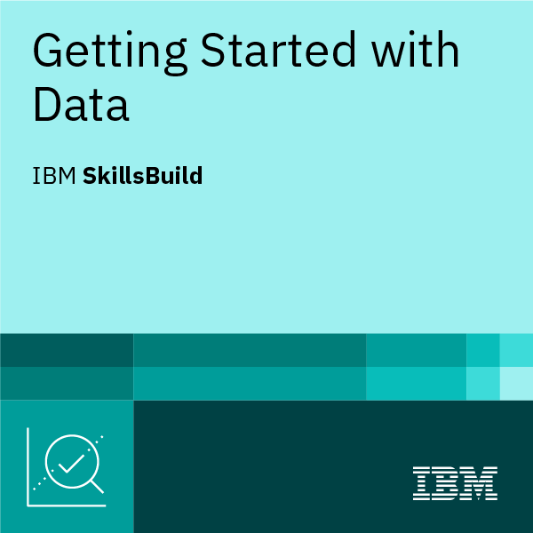

# Hi, I'm Cez Joi 👋

🎯 **Aspiring Data Analyst | SQL | Python | Excel | Data Visualization**

Welcome to my GitHub! I am now exploring about turning raw data into meaningful insights.  
Currently pursuing the **IBM Data Science Professional Certificate** and building hands-on projects in analytics, visualization, and reporting. Familiarization on Git/Github.  

---

## 🛠️ Skills & Tools ( GOALS for Q4 of 2025)
- **Languages:** Python (Pandas, NumPy), SQL  
- **Visualization:** Tableau, Power BI, Matplotlib, Seaborn  
- **Data Wrangling:** Excel, Google Sheets  
- **Other Tools:** Git/GitHub, Jupyter Notebooks  

---

## 🏅 Certifications & Badges

  
---

  
  <!--
  
  
  
  -->

### 📜 Certificates

> Full copies (PDF/links):  
> - [SQL and Relational Databases 101 (SkillsBuild)](https://courses.skillsbuild.skillsnetwork.site/certificates/94c562aabee44901b47ab511131f4e7a#)

> - [IBM Getting Started with Data (PDF)](badges_certificates/IBMDesign20250826-7-vzw5c6.pdf)  

<!--
> - [Data Science Foundations (PDF)](badges_certificates/ibm-data-science-foundations-certificate.pdf)  
> - [Data Analytics Certificate (PDF)](badges_certificates/ibm-data-analytics-certificate.pdf)  

---

## 📂 Featured Projects
- 📊 **Sales Performance Dashboard** — Power BI & Excel   
  *KPIs by region/product, variance vs target.*  
  Repo: https://github.com/yourusername/sales-dashboard  

- 🛒 **E-Commerce Customer Segmentation** — Python, scikit-learn  
  *RFM features, K-Means clustering, profile segments.*  
  Repo: https://github.com/yourusername/ecommerce-segmentation  

- 📈 **COVID-19 Trends Analysis** — SQL + Python Viz  
  *Time-series queries, rolling averages, clear charts.*  
  Repo: https://github.com/yourusername/covid19-analysis  

---
-->

## 🎓 Current Learning
- IBM Data Science Professional Certificate (SkillsBuild track)  
- Weekly hands-on projects in Python, SQL & BI dashboards  

## 🌐 Languages

| Language | Proficiency |
|----------|-------------|
| 🇬🇧 English | Fluent |
| 🇵🇭 Filipino | Native |
| 🇩🇪 German | A1 (Beginner) |

## 📫 Connect
- 🌐 LinkedIn: https://www.linkedin.com/in/yourprofile  
- ✉️ Email: cvillarama12@gmail.com

---

⭐️ I’m open to entry-level **Data Analyst / BI** roles. Let’s connect!
 

