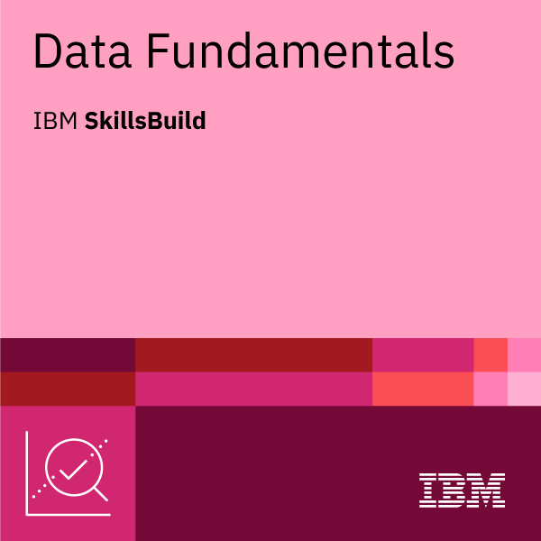

# 📊 Data Enthusiast | Banking IT Expert | Future Data Analyst

# Hi, I'm Cez Joi 👋

I’m a **Senior RPG/AS400 Analyst Programmer** with over **18 years of experience** working in Software Development. Throughout my 12 years of career, I’ve been part of the **Core Banking IT Team** at one of the biggest banks in the Philippines where I specialized in:

- 🧾 **General Ledger systems** – ensuring accurate, reliable, and automated financial reporting  
- 🛡 **AMLA (Anti-Money Laundering Act) systems** – developing solutions to strengthen compliance and security  

💡 My expertise lies in designing, developing, and maintaining robust banking applications that balance **business needs, compliance, and performance**.  

I’m passionate about:
- Clean and efficient code  
- Solving complex financial and regulatory challenges with technology  
- Continuous learning and sharing knowledge  

---

📊 **Currently, I am exploring a transition into Data Analytics**  

🎯 **Aspiring Data Analyst | SQL | Python | Excel | Data Visualization**

Pursuing the **IBM Data Science Professional Certificate** and building hands-on projects in analytics, visualization, and reporting.  

---

## 🛠️ Skills & Tools ( GOALS for Q4 of 2025)
- **Languages:** Python (Pandas, NumPy), SQL  
- **Visualization:** Tableau, Power BI, Matplotlib, Seaborn  
- **Data Wrangling:** Excel, Google Sheets  
- **Other Tools:** Git/GitHub, Jupyter Notebooks  

 <!--
## 🛠 Currently Learning & Using  

  
  
  
  
  
  

  
 -->
---

## 🏅 Certifications & Badges

  

  

  
  

  <!--
  
  
  
  -->

### 📜 Certificates

> Full copies (PDF/links):  
> - [SQL and Relational Databases 101 (SkillsBuild)](https://courses.skillsbuild.skillsnetwork.site/certificates/94c562aabee44901b47ab511131f4e7a#)
> - [IBM Getting Started with Data (PDF)](badges_certificates/IBMDesign20250826-7-vzw5c6.pdf)
> - [IBM Getting Started with Data (PDF)](badges_certificates/IBMDesign20250826-7-vzw5c6.pdf)
> - [IBM Data Fundamentals (PDF)](badges_certificates/IBMDesign20250829_DataFundamentals.pdf)  
<!--
> - [Data Science Foundations (PDF)](badges_certificates/ibm-data-science-foundations-certificate.pdf)  
> - [Data Analytics Certificate (PDF)](badges_certificates/ibm-data-analytics-certificate.pdf)  

---

## 📂 Featured Projects
- 📊 **Sales Performance Dashboard** — Power BI & Excel   
  *KPIs by region/product, variance vs target.*  
  Repo: https://github.com/yourusername/sales-dashboard  

- 🛒 **E-Commerce Customer Segmentation** — Python, scikit-learn  
  *RFM features, K-Means clustering, profile segments.*  
  Repo: https://github.com/yourusername/ecommerce-segmentation  

- 📈 **COVID-19 Trends Analysis** — SQL + Python Viz  
  *Time-series queries, rolling averages, clear charts.*  
  Repo: https://github.com/yourusername/covid19-analysis  

---
-->

## 🎓 Current Learning
- IBM Data Science Professional Certificate (SkillsBuild track)  
- Weekly hands-on projects in Python, SQL & BI dashboards  

## 🌐 Languages

| Language | Proficiency |
|----------|-------------|
| 🇬🇧 English | Fluent |
| 🇵🇭 Filipino | Native |
| 🇩🇪 German | A1 (Beginner) |

## 📫 Connect
- 🌐 LinkedIn: https://www.linkedin.com/in/Cecille-Joy-Villarama  
- ✉️ Email: cvillarama12@gmail.com

---

⭐️ I’m open to entry-level **Data Analyst / BI** roles. Let’s connect!
 

